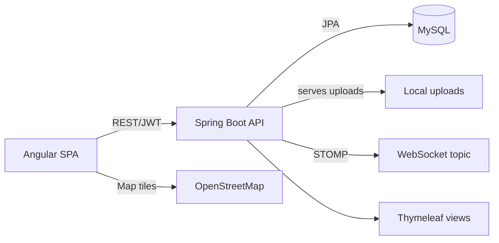

# System Architecture Audit

## Audit Scope
Project root: `C:\Users\ANGELO ANDRADE\Documents\2026\Desarrollo Web\ProyectoWEB`.

Audit timestamp: 2026-07-21. Discovery: root contained `.git` but no root Maven/Gradle/workspace manifest and no direct-child independent build marker; fallback rule selected root as one module. Nested apps inspected within that scope.

| Module | Path | Stack | Report |
| --- | --- | --- | --- |
| ProyectoWEB | `.` | Spring Boot/Java/Maven; Angular/TypeScript/npm | [Recovered report](audit-proyectoweb.md) |

Module-agent report write initially failed because sub-agent policy prohibited writes; read-only findings were recovered and persisted by audit coordinator. No module evidence was lost.

## System Architecture
Single marketplace system: Angular SPA supplies public browse/map/voice-search and admin UI; Spring Boot exposes REST, JWT security, uploads, WebSocket, JPA/MySQL, and also retains Thymeleaf presentation. Backend structure is controller/service/repository/entity, though `TiendaController` bypasses services. Order domain exists but is not an end-to-end feature.

## Module Dependency Map

## Cross-Cutting Concerns
Authentication uses username JWTs; public role selection enables admin escalation. Authorization is inconsistent: service checks coexist with direct controller persistence. MySQL root credentials and automatic DDL are committed configuration. Errors/validation are ad hoc. No repository evidence of observability, CI, deployment, migrations, backup, rate limiting, health checks, or runtime secret management. Shared hardcoded localhost URLs couple frontend, backend, and upload links.

## Prioritized Findings
- **Critical:** [DB root password tracked](audit-proyectoweb.md) in `application.properties:3-5`; rotate and externalize.
- **Critical:** [Client-selected admin role](audit-proyectoweb.md) in `RegisterRequest`/`AuthService`; force public registration to client role.
- **High:** [Unauthenticated arbitrary file upload](audit-proyectoweb.md) in `ImagenController` and security rules.
- **High:** [Unrestricted WebSocket origin/message policy](audit-proyectoweb.md) in `WebSocketConfig`.
- **High:** [Broken product API contract](audit-proyectoweb.md): frontend calls missing search/image endpoints.
- **High:** [Stored XSS map popup](audit-proyectoweb.md) in `Frontend/src/app/componentes/mapa/mapa.ts:123-137`.
- **High:** [Tests mutate local MySQL](audit-proyectoweb.md).
- **Medium:** JWT key/error handling, ownership enforcement, validation/error handling, hardcoded endpoints, schema migration, and unbounded catalog loads.
- **Low:** predictable seed accounts, weak tests, scaffold documentation, and no CI evidence.

## Recommended Next Steps
Quick wins:
1. Rotate database credential; remove secret; use environment-injected restricted DB user.
2. Remove public `ADMIN` registration; restrict uploads and WebSocket origins/destinations.
3. Fix missing product API contract and add API/security regression tests.
4. Escape map popup values and stop storing bearer tokens in localStorage where feasible.

Architectural work:
1. Establish service-only mutation/ownership boundary and consistent validation/error policy.
2. Create dev/test/prod configuration, migrations, Testcontainers tests, and pagination/search boundaries.
3. Select/document one presentation strategy, complete/remove dormant order paths, and introduce CI, deployment, observability, and operations runbooks.

## Audit Limitations
Runtime services and database were unavailable; tests were not run because current tests target configured local MySQL and mutate data. No production deployment, CI, infrastructure, API specification, migration, monitoring, or secret-management evidence found. Existing uncommitted backend changes were read but not changed. The sole module sub-agent could not write its report due tool policy; its recovered read-only evidence was used for the report above.
